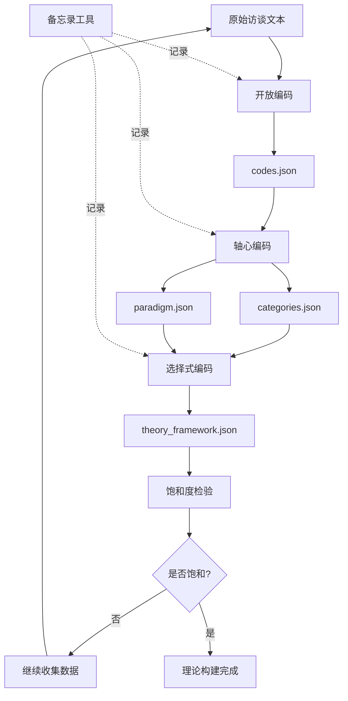
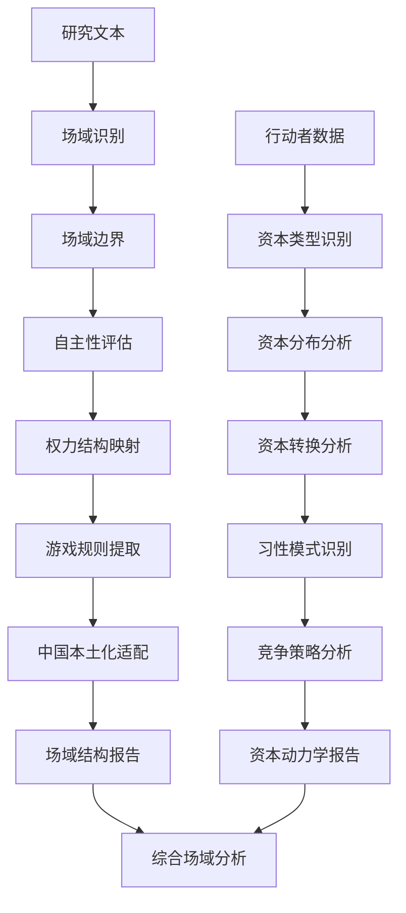

# SSCI技能包完整修复计划 (SpecKit规范)

**计划版本**: 1.0.0  
**创建日期**: 2025-12-18  
**基于**: SKILL_AUDIT_REPORT.md 核查分析  
**遵循规范**: SpecKit + SOLID + TDD + KISS + YAGNI  
**目标**: 真实可用、理论严谨、测试完备

---

## 📋 执行摘要

基于全面核查分析，本计划将修复6个未实现技能，完善2个部分实现技能，补充测试覆盖，统一架构规范。遵循SpecKit三阶段方法论：

1. **需求规格化** (Requirements Specification) - 明晰无歧义的需求文档
2. **设计文档化** (Design Documentation) - 基于SOLID原则的架构设计
3. **TDD任务化** (TDD Task List) - 测试驱动的开发清单

---

## 🎯 Phase 1: 需求规格化 (Requirements Specification)

### 1.1 核心原则

- **KISS原则**: 保持简单，避免过度设计
- **YAGNI原则**: 只实现必要功能，不做预测性开发
- **理论严谨**: 严格遵循社会科学理论框架
- **中文优化**: 专门针对中文研究场景
- **渐进披露**: 3层信息结构（概念→发现→详细）

### 1.2 待修复技能清单

#### 优先级1 (Critical) - 扎根理论核心技能

##### REQ-001: performing-axial-coding (轴心编码)
**规格ID**: SCI-GT-002  
**理论基础**: Strauss & Corbin 扎根理论方法论  
**当前状态**: 仅文档定义  
**目标状态**: 完整Python实现 + 测试覆盖

**功能需求**:
```yaml
FR-001-01: 范畴识别
  描述: 从开放编码结果中识别主要范畴
  输入: 开放编码JSON结果 (codes.json)
  输出: 范畴列表 (categories.json)
  准确率: ≥85%
  
FR-001-02: 属性维度分析
  描述: 分析每个范畴的属性和维度
  输入: 范畴列表 + 原始编码数据
  输出: 范畴属性矩阵
  完整性: ≥90%
  
FR-001-03: 范畴关系建立
  描述: 建立范畴间的因果、关联关系
  输入: 范畴列表 + 访谈数据
  输出: 关系网络图
  关系类型: [因果, 关联, 包含, 对立]
  
FR-001-04: Paradigm模型构建
  描述: 构建条件-行动-结果范式模型
  输入: 范畴关系网络
  输出: Paradigm模型JSON
  组件: [条件, 现象, 语境, 中介条件, 行动策略, 结果]
```

**非功能需求**:
```yaml
NFR-001-01: 性能
  处理速度: 1000个编码 < 5秒
  内存使用: < 500MB
  
NFR-001-02: 可用性
  API简单: 单函数调用
  错误提示: 中文友好
  
NFR-001-03: 可维护性
  代码注释: ≥30%
  模块化: 单一职责
  
NFR-001-04: 兼容性
  Python版本: ≥3.8
  依赖最小化: 核心依赖≤5个
```

**验收标准**:
```gherkin
Scenario: 轴心编码完整流程
  Given 包含50个开放编码的codes.json文件
  When 执行轴心编码分析
  Then 应识别出5-10个主要范畴
  And 每个范畴应包含至少3个属性
  And 应建立至少8条范畴间关系
  And 应生成完整的Paradigm模型
  And 执行时间应少于5秒
```

---

##### REQ-002: performing-selective-coding (选择式编码)
**规格ID**: SCI-GT-003  
**理论基础**: Strauss & Corbin 扎根理论方法论  
**当前状态**: 仅文档定义  
**目标状态**: 完整Python实现 + 测试覆盖

**功能需求**:
```yaml
FR-002-01: 核心范畴识别
  描述: 从轴心编码结果中识别核心范畴
  输入: 范畴列表 + Paradigm模型
  输出: 核心范畴 (1-2个)
  算法: 中心性分析 + 覆盖度评估
  
FR-002-02: 故事线构建
  描述: 围绕核心范畴构建理论故事线
  输入: 核心范畴 + 所有范畴关系
  输出: 故事线文本 + 可视化
  要求: 逻辑连贯、理论完整
  
FR-002-03: 理论框架整合
  描述: 将所有范畴整合为理论框架
  输入: 核心范畴 + 故事线
  输出: 理论框架图 + 命题列表
  格式: JSON + Markdown + 可视化
  
FR-002-04: 理论饱和验证
  描述: 验证理论是否达到饱和
  输入: 理论框架 + 新数据
  输出: 饱和度评估报告
  阈值: ≥85%
```

**验收标准**:
```gherkin
Scenario: 选择式编码理论构建
  Given 完整的轴心编码结果
  When 执行选择式编码
  Then 应识别出1个核心范畴
  And 应生成完整的理论故事线
  And 应包含至少5个理论命题
  And 应生成可视化理论框架图
```

---

##### REQ-003: writing-grounded-theory-memos (扎根理论备忘录)
**规格ID**: SCI-GT-004  
**理论基础**: Charmaz 备忘录写作方法  
**当前状态**: 仅文档定义  
**目标状态**: 工具辅助实现 + 模板系统

**功能需求**:
```yaml
FR-003-01: 备忘录模板管理
  描述: 提供多种备忘录模板
  模板类型:
    - 概念定义备忘录
    - 关系发现备忘录
    - 方法反思备忘录
    - 理论整合备忘录
  
FR-003-02: 自动化记录
  描述: 在编码过程中自动记录关键决策
  触发点:
    - 新概念识别
    - 范畴建立
    - 关系发现
    - 理论洞见
  
FR-003-03: 备忘录检索
  描述: 按时间、主题、类型检索备忘录
  索引: 全文索引 + 标签系统
  
FR-003-04: 备忘录分析
  描述: 分析备忘录中的理论发展轨迹
  输出: 理论演化时间线
```

**验收标准**:
```gherkin
Scenario: 备忘录辅助理论构建
  Given 正在进行扎根理论研究
  When 使用备忘录工具记录分析过程
  Then 应自动生成至少10条备忘录
  And 应支持按主题检索
  And 应生成理论发展时间线
```

---

#### 优先级2 (High) - 场域分析完善

##### REQ-004: field-structure-skill 完善
**规格ID**: SCI-FIELD-001  
**理论基础**: Pierre Bourdieu 场域理论  
**当前状态**: 架构完整，实现40%  
**目标状态**: 完整实现 + 测试覆盖

**功能需求**:
```yaml
FR-004-01: 场域边界识别
  描述: 识别场域的边界和范围
  输入: 研究文本 + 语境数据
  输出: 场域边界描述 + 可视化
  算法: 关键词聚类 + 语义分析
  
FR-004-02: 自主性评估
  描述: 评估场域相对于外部的自主性
  输入: 场域数据 + 外部影响数据
  输出: 自主性得分 (0-1)
  维度: [经济, 政治, 文化]
  
FR-004-03: 权力结构映射
  描述: 映射场域内的权力关系结构
  输入: 行动者数据 + 关系数据
  输出: 权力结构图
  指标: [位置, 资本量, 影响力]
  
FR-004-04: 游戏规则提取
  描述: 提取场域的内在游戏规则
  输入: 行为数据 + 规范文本
  输出: 规则列表 + 遵守度分析
  
FR-004-05: 中国本土化适配
  描述: 适配中国特色的场域特征
  特征:
    - 单位制度影响
    - 关系网络重要性
    - 政治资本作用
    - 等级制度特征
```

**验收标准**:
```gherkin
Scenario: 教育场域分析
  Given 关于中国高等教育的研究数据
  When 执行场域结构分析
  Then 应识别出教育场域的边界
  And 应评估场域自主性得分
  And 应映射出权力结构图
  And 应提取至少5条游戏规则
  And 应包含中国本土化特征分析
```

---

##### REQ-005: capital-dynamics-skill 完善
**规格ID**: SCI-FIELD-002  
**理论基础**: Pierre Bourdieu 资本理论  
**当前状态**: 架构完整，实现30%  
**目标状态**: 完整实现 + 测试覆盖

**功能需求**:
```yaml
FR-005-01: 资本类型识别
  描述: 识别和分类不同形式的资本
  资本类型:
    - 文化资本 (学历, 知识, 品味)
    - 社会资本 (关系网络, 社会地位)
    - 经济资本 (财富, 收入)
    - 象征资本 (声望, 荣誉)
    - 政治资本 (权力, 职位) [中国扩展]
    - 关系资本 (人脉, 面子) [中国扩展]
  
FR-005-02: 资本分布分析
  描述: 分析资本在场域中的分布
  输出: 资本分布图 + 不平等指数
  指标: Gini系数, 集中度
  
FR-005-03: 资本转换分析
  描述: 分析不同资本形式间的转换
  输入: 行动者轨迹数据
  输出: 转换路径 + 转换率
  转换类型: [文化→经济, 社会→政治, 等]
  
FR-005-04: 习性模式识别
  描述: 识别行动者的习性模式
  输入: 行为数据 + 背景数据
  输出: 习性类型 + 特征描述
  维度: [品味, 行为倾向, 价值观]
  
FR-005-05: 竞争策略分析
  描述: 分析场域内的竞争策略
  输入: 行动者行为数据
  输出: 策略类型 + 效果评估
```

**验收标准**:
```gherkin
Scenario: 学术场域资本分析
  Given 关于学术精英的研究数据
  When 执行资本动力学分析
  Then 应识别出6种资本类型
  And 应生成资本分布图
  And 应识别至少3条资本转换路径
  And 应识别出3-5种习性模式
  And 应包含中国特色资本分析
```

---

#### 优先级3 (Medium) - 辅助工具完善

##### REQ-006: processing-network-data (网络数据处理)
**规格ID**: SCI-NET-001  
**当前状态**: 仅文档定义  
**目标状态**: 数据预处理工具

**功能需求**:
```yaml
FR-006-01: 关系数据提取
  描述: 从原始数据提取关系数据
  输入格式: [文本, Excel, CSV, 问卷]
  输出: 标准化关系列表
  
FR-006-02: 邻接矩阵构建
  描述: 构建网络的邻接矩阵
  输入: 关系列表
  输出: 邻接矩阵 (numpy array)
  
FR-006-03: 数据清洗验证
  描述: 清洗和验证网络数据
  检查项:
    - 重复关系
    - 自环
    - 孤立节点
    - 数据完整性
```

---

##### REQ-007: resolving-research-conflicts (研究冲突解决)
**规格ID**: SCI-METHOD-001  
**当前状态**: 仅文档定义  
**目标状态**: 决策辅助工具

**功能需求**:
```yaml
FR-007-01: 冲突识别
  描述: 识别研究中的分歧和冲突
  冲突类型:
    - 理论分歧
    - 方法论争议
    - 解释冲突
    - 价值观分歧
  
FR-007-02: 解决建议
  描述: 提供冲突解决建议
  策略:
    - 理论整合
    - 方法三角验证
    - 多元解释
    - 价值澄清
```

---

### 1.3 测试覆盖增强需求

##### REQ-008: mathematical-statistics 测试
**规格ID**: SCI-TEST-001  
**目标**: 测试覆盖率从0%提升至80%

**测试需求**:
```yaml
TS-008-01: 描述性统计测试
  测试用例: 15个
  覆盖功能: 均值、标准差、偏度、峰度、正态性检验
  
TS-008-02: 相关分析测试
  测试用例: 12个
  覆盖功能: Pearson, Spearman, Kendall相关
  
TS-008-03: 回归分析测试
  测试用例: 20个
  覆盖功能: 线性回归、逻辑回归、残差分析
  
TS-008-04: 方差分析测试
  测试用例: 15个
  覆盖功能: 单因素ANOVA, 多因素ANOVA, 事后检验
  
TS-008-05: 因子分析测试
  测试用例: 18个
  覆盖功能: KMO检验, 因子提取, 旋转, 载荷
```

---

##### REQ-009: validity-reliability 测试
**规格ID**: SCI-TEST-002  
**目标**: 测试覆盖率从0%提升至80%

**测试需求**:
```yaml
TS-009-01: 信度分析测试
  测试用例: 12个
  覆盖功能: Cronbach's Alpha, 分半信度, 项目分析
  
TS-009-02: 效度分析测试
  测试用例: 15个
  覆盖功能: 内容效度, 构念效度, 效标效度
  
TS-009-03: 因子分析测试
  测试用例: 18个
  覆盖功能: EFA, CFA, 拟合指标
```

---

##### REQ-010: 集成测试和端到端测试
**规格ID**: SCI-TEST-003  
**目标**: 运行并通过所有集成测试和E2E测试

**测试需求**:
```yaml
TS-010-01: 集成测试
  测试套件: 3个 (skills_launcher, smart_deployer, web_interface)
  测试用例: 64个
  目标通过率: ≥95%
  
TS-010-02: 端到端测试
  测试套件: 1个 (end_to_end_automation)
  测试用例: 35个
  目标通过率: ≥90%
  
TS-010-03: 性能测试
  测试套件: 1个 (performance_benchmarks)
  测试用例: 20个
  目标通过率: ≥85%
```

---

## 🏗️ Phase 2: 设计文档化 (Design Documentation)

### 2.1 SOLID原则应用

#### 扎根理论技能设计

##### performing-axial-coding 架构设计

**SOLID原则映射**:
```
S - 单一职责原则 (SRP)
  ├── CategoryIdentifier - 只负责范畴识别
  ├── AttributeAnalyzer - 只负责属性分析
  ├── RelationshipBuilder - 只负责关系建立
  └── ParadigmConstructor - 只负责Paradigm构建

O - 开闭原则 (OCP)
  ├── ICategoryAnalyzer接口 - 支持不同的范畴识别算法
  ├── IRelationshipDetector接口 - 支持不同的关系检测方法
  └── IParadigmBuilder接口 - 支持不同的模型构建策略

L - 里氏替换原则 (LSP)
  └── 所有实现类可以替换其接口，保证行为一致性

I - 接口隔离原则 (ISP)
  ├── ICategoryIdentifier - 范畴识别专用接口
  ├── IAttributeExtractor - 属性提取专用接口
  └── IRelationshipMapper - 关系映射专用接口

D - 依赖倒置原则 (DIP)
  └── 依赖抽象的编码概念，而非具体的数据结构
```

**类图设计**:
```python
# 接口定义
class ICategoryAnalyzer(ABC):
    @abstractmethod
    def identify_categories(self, codes: List[Code]) -> List[Category]:
        pass
    
    @abstractmethod
    def analyze_attributes(self, category: Category) -> CategoryAttributes:
        pass

class IRelationshipDetector(ABC):
    @abstractmethod
    def detect_relationships(self, categories: List[Category]) -> List[Relationship]:
        pass

class IParadigmBuilder(ABC):
    @abstractmethod
    def build_paradigm(self, relationships: List[Relationship]) -> ParadigmModel:
        pass

# 具体实现
class FrequencyBasedCategoryIdentifier(ICategoryAnalyzer):
    """基于频率的范畴识别器"""
    def identify_categories(self, codes: List[Code]) -> List[Category]:
        # 实现基于频率聚类的范畴识别
        pass

class SemanticAttributeAnalyzer(ICategoryAnalyzer):
    """基于语义的属性分析器"""
    def analyze_attributes(self, category: Category) -> CategoryAttributes:
        # 实现语义相似度的属性分析
        pass

class ContextualRelationshipDetector(IRelationshipDetector):
    """基于上下文的关系检测器"""
    def detect_relationships(self, categories: List[Category]) -> List[Relationship]:
        # 实现基于共现和上下文的关系检测
        pass

class StraussParadigmBuilder(IParadigmBuilder):
    """Strauss范式模型构建器"""
    def build_paradigm(self, relationships: List[Relationship]) -> ParadigmModel:
        # 实现Strauss的条件-行动-结果模型
        pass

# 主技能类
class AxialCodingSkill:
    def __init__(
        self,
        category_analyzer: ICategoryAnalyzer,
        relationship_detector: IRelationshipDetector,
        paradigm_builder: IParadigmBuilder
    ):
        self.category_analyzer = category_analyzer
        self.relationship_detector = relationship_detector
        self.paradigm_builder = paradigm_builder
    
    def execute(self, codes_data: Dict) -> Dict:
        """执行轴心编码"""
        # 1. 识别范畴
        categories = self.category_analyzer.identify_categories(codes_data['codes'])
        
        # 2. 分析属性
        for category in categories:
            category.attributes = self.category_analyzer.analyze_attributes(category)
        
        # 3. 检测关系
        relationships = self.relationship_detector.detect_relationships(categories)
        
        # 4. 构建Paradigm
        paradigm = self.paradigm_builder.build_paradigm(relationships)
        
        return self._format_result(categories, relationships, paradigm)
```

**数据模型设计**:
```python
@dataclass
class Code:
    """开放编码"""
    code: str
    definition: str
    examples: List[str]
    frequency: int
    context: str

@dataclass
class Category:
    """范畴"""
    name: str
    codes: List[Code]
    attributes: CategoryAttributes
    dimension: str
    importance: float

@dataclass
class CategoryAttributes:
    """范畴属性"""
    properties: List[str]
    dimensions: Dict[str, List[str]]
    variations: List[str]

@dataclass
class Relationship:
    """范畴关系"""
    source: Category
    target: Category
    type: RelationType  # CAUSAL, ASSOCIATIVE, INCLUSIVE, OPPOSITIONAL
    strength: float
    evidence: List[str]

@dataclass
class ParadigmModel:
    """Paradigm模型"""
    phenomenon: Category  # 现象
    causal_conditions: List[Category]  # 因果条件
    context: List[Category]  # 语境
    intervening_conditions: List[Category]  # 中介条件
    action_strategies: List[Category]  # 行动策略
    consequences: List[Category]  # 结果
```

---

##### performing-selective-coding 架构设计

**SOLID原则映射**:
```
S - 单一职责原则
  ├── CoreCategoryIdentifier - 只负责核心范畴识别
  ├── StorylineGenerator - 只负责故事线生成
  ├── TheoryIntegrator - 只负责理论整合
  └── SaturationValidator - 只负责饱和度验证

O - 开闭原则
  ├── ICoreIdentifier接口 - 支持不同的核心识别算法
  └── IStorylineBuilder接口 - 支持不同的故事线构建方法

L - 里氏替换原则
  └── 所有实现可替换接口

I - 接口隔离原则
  ├── ICoreIdentifier - 核心识别专用
  └── ITheoryBuilder - 理论构建专用

D - 依赖倒置原则
  └── 依赖抽象的理论概念
```

**类图设计**:
```python
class ICoreIdentifier(ABC):
    @abstractmethod
    def identify_core_category(self, categories: List[Category]) -> Category:
        pass

class IStorylineBuilder(ABC):
    @abstractmethod
    def build_storyline(self, core: Category, paradigm: ParadigmModel) -> Storyline:
        pass

class ITheoryIntegrator(ABC):
    @abstractmethod
    def integrate_theory(self, storyline: Storyline) -> TheoryFramework:
        pass

# 实现类
class CentralityBasedCoreIdentifier(ICoreIdentifier):
    """基于中心性的核心范畴识别"""
    def identify_core_category(self, categories: List[Category]) -> Category:
        # 计算每个范畴的中心性得分
        # 选择中心性最高且覆盖度最广的范畴
        pass

class NarrativeStorylineBuilder(IStorylineBuilder):
    """叙事式故事线构建器"""
    def build_storyline(self, core: Category, paradigm: ParadigmModel) -> Storyline:
        # 围绕核心范畴构建连贯的理论叙事
        pass

class PropositionBasedTheoryIntegrator(ITheoryIntegrator):
    """基于命题的理论整合器"""
    def integrate_theory(self, storyline: Storyline) -> TheoryFramework:
        # 将故事线转化为理论命题和框架
        pass

# 主技能类
class SelectiveCodingSkill:
    def __init__(
        self,
        core_identifier: ICoreIdentifier,
        storyline_builder: IStorylineBuilder,
        theory_integrator: ITheoryIntegrator
    ):
        self.core_identifier = core_identifier
        self.storyline_builder = storyline_builder
        self.theory_integrator = theory_integrator
    
    def execute(self, axial_coding_result: Dict) -> Dict:
        """执行选择式编码"""
        # 1. 识别核心范畴
        core_category = self.core_identifier.identify_core_category(
            axial_coding_result['categories']
        )
        
        # 2. 构建故事线
        storyline = self.storyline_builder.build_storyline(
            core_category,
            axial_coding_result['paradigm']
        )
        
        # 3. 整合理论
        theory = self.theory_integrator.integrate_theory(storyline)
        
        return self._format_result(core_category, storyline, theory)
```

**数据模型设计**:
```python
@dataclass
class Storyline:
    """理论故事线"""
    core_category: Category
    narrative: str
    key_elements: List[str]
    logical_flow: List[Tuple[Category, Category]]

@dataclass
class TheoryFramework:
    """理论框架"""
    core_category: Category
    storyline: Storyline
    propositions: List[Proposition]
    conceptual_model: Dict
    visualization: str  # DOT格式

@dataclass
class Proposition:
    """理论命题"""
    statement: str
    evidence: List[str]
    confidence: float
```

---

#### 场域分析技能设计

##### field-structure-skill 完善设计

**SOLID原则映射**:
```
S - 单一职责原则
  ├── FieldBoundaryAnalyzer - 只负责边界识别
  ├── AutonomyAssessor - 只负责自主性评估
  ├── PowerStructureMapper - 只负责权力结构映射
  ├── RulesExtractor - 只负责规则提取
  └── ChineseFieldAdapter - 只负责中国本土化

O - 开闭原则
  ├── IFieldAnalyzer接口 - 支持不同的场域分析方法
  └── ILocalizationAdapter接口 - 支持不同的本土化策略

L - 里氏替换原则
  └── 所有实现可替换接口

I - 接口隔离原则
  ├── IBoundaryAnalyzer - 边界分析专用
  ├── IAutonomyCalculator - 自主性计算专用
  └── IPowerMapper - 权力映射专用

D - 依赖倒置原则
  └── 依赖抽象的布迪厄理论概念
```

**类图设计**:
```python
class IFieldAnalyzer(ABC):
    @abstractmethod
    def analyze_field(self, context_data: Dict) -> FieldStructure:
        pass

class IBoundaryAnalyzer(ABC):
    @abstractmethod
    def identify_boundary(self, data: Dict) -> FieldBoundary:
        pass

class IAutonomyCalculator(ABC):
    @abstractmethod
    def assess_autonomy(self, field: Field, external_data: Dict) -> AutonomyScore:
        pass

# 实现类
class KeywordClusteringBoundaryAnalyzer(IBoundaryAnalyzer):
    """基于关键词聚类的边界识别"""
    def identify_boundary(self, data: Dict) -> FieldBoundary:
        # 使用关键词聚类识别场域边界
        pass

class MultiDimensionalAutonomyAssessor(IAutonomyCalculator):
    """多维度自主性评估器"""
    def assess_autonomy(self, field: Field, external_data: Dict) -> AutonomyScore:
        # 从经济、政治、文化三个维度评估自主性
        pass

class NetworkBasedPowerMapper:
    """基于网络的权力结构映射器"""
    def map_power_structure(self, actors: List[Actor]) -> PowerStructure:
        # 使用网络分析映射权力结构
        pass

class ChineseFieldAdapter:
    """中国场域本土化适配器"""
    def adapt_to_chinese_context(self, field: Field) -> ChineseFieldFeatures:
        # 识别单位制、关系网络等中国特色
        pass

# 主技能类
class FieldStructureSkill:
    def __init__(
        self,
        boundary_analyzer: IBoundaryAnalyzer,
        autonomy_assessor: IAutonomyCalculator,
        power_mapper: NetworkBasedPowerMapper,
        chinese_adapter: ChineseFieldAdapter
    ):
        self.boundary_analyzer = boundary_analyzer
        self.autonomy_assessor = autonomy_assessor
        self.power_mapper = power_mapper
        self.chinese_adapter = chinese_adapter
    
    def execute(self, context_data: Dict) -> Dict:
        """执行场域结构分析"""
        # 1. 识别边界
        boundary = self.boundary_analyzer.identify_boundary(context_data)
        
        # 2. 评估自主性
        autonomy = self.autonomy_assessor.assess_autonomy(boundary, context_data)
        
        # 3. 映射权力结构
        power_structure = self.power_mapper.map_power_structure(context_data['actors'])
        
        # 4. 中国本土化
        chinese_features = self.chinese_adapter.adapt_to_chinese_context(boundary)
        
        return self._format_result(boundary, autonomy, power_structure, chinese_features)
```

**数据模型设计**:
```python
@dataclass
class FieldBoundary:
    """场域边界"""
    name: str
    scope: str
    key_actors: List[str]
    defining_features: List[str]

@dataclass
class AutonomyScore:
    """自主性得分"""
    overall: float  # 0-1
    economic: float
    political: float
    cultural: float
    factors: List[str]

@dataclass
class PowerStructure:
    """权力结构"""
    hierarchy: Dict[str, int]  # 层级
    dominant_positions: List[str]
    dominated_positions: List[str]
    power_relations: List[Tuple[str, str, float]]

@dataclass
class ChineseFieldFeatures:
    """中国场域特征"""
    danwei_influence: float  # 单位制影响
    guanxi_importance: float  # 关系重要性
    political_capital_role: float  # 政治资本作用
    hierarchy_acceptance: float  # 等级接受度
```

---

### 2.2 数据流设计

#### 扎根理论完整流程



#### 场域分析完整流程



---

### 2.3 接口设计

#### 统一技能接口

```python
class ISkill(ABC):
    """统一技能接口"""
    
    @abstractmethod
    def get_info(self) -> SkillInfo:
        """获取技能信息"""
        pass
    
    @abstractmethod
    def execute(self, input_data: Dict, options: Dict = None) -> Dict:
        """执行技能"""
        pass
    
    @abstractmethod
    def validate_input(self, input_data: Dict) -> ValidationResult:
        """验证输入"""
        pass
    
    @abstractmethod
    def validate_output(self, output_data: Dict) -> ValidationResult:
        """验证输出"""
        pass

@dataclass
class SkillInfo:
    """技能信息"""
    name: str
    version: str
    description: str
    capabilities: List[str]
    input_format: Dict
    output_format: Dict
    dependencies: List[str]

@dataclass
class ValidationResult:
    """验证结果"""
    is_valid: bool
    errors: List[str]
    warnings: List[str]
```

#### 3层渐进式输出格式

```python
@dataclass
class SkillOutput:
    """统一输出格式"""
    
    # 第1层：核心概念 (5-10秒理解)
    overview: Overview
    
    # 第2层：关键发现 (30秒阅读)
    summary: Summary
    
    # 第3层：详细数据 (深入分析)
    details: Details
    
    # 元数据
    metadata: Metadata

@dataclass
class Overview:
    """核心概念层"""
    title: str
    key_findings: List[str]  # 3-5个关键发现
    description: str  # 100字以内

@dataclass
class Summary:
    """关键发现层"""
    metrics: Dict[str, float]
    top_items: List[Any]  # 前5-10项
    visualizations: List[str]  # 可视化图表

@dataclass
class Details:
    """详细数据层"""
    full_data: Dict
    raw_results: Any
    performance: PerformanceMetrics

@dataclass
class Metadata:
    """元数据"""
    skill_name: str
    version: str
    timestamp: str
    processing_time: float
    data_source: str
```

---

## 🧪 Phase 3: TDD任务化 (TDD Task List)

### 3.1 TDD开发流程

**Red-Green-Refactor循环**:
```
1. RED   - 编写失败的测试用例
2. GREEN - 编写最少代码使测试通过
3. REFACTOR - 重构代码，保持测试通过
```

---

### 3.2 performing-axial-coding TDD任务清单

#### Sprint 1: 范畴识别 (3天)

**Task 1.1: 范畴识别器测试** (RED)
```python
# tests/unit/test_category_identifier.py

def test_identify_categories_from_codes():
    """测试从编码中识别范畴"""
    # Given
    codes = [
        Code("寻求帮助", "向他人寻求帮助", ["例子1"], 10, "学习困难"),
        Code("获得支持", "得到他人支持", ["例子2"], 8, "学习困难"),
        Code("建立关系", "建立社交关系", ["例子3"], 5, "社交"),
        # ... 更多编码
    ]
    identifier = FrequencyBasedCategoryIdentifier()
    
    # When
    categories = identifier.identify_categories(codes)
    
    # Then
    assert len(categories) >= 3
    assert "学习支持" in [c.name for c in categories]
    assert all(len(c.codes) >= 2 for c in categories)

def test_category_naming_is_meaningful():
    """测试范畴命名有意义"""
    codes = load_test_codes("test_data/codes_sample.json")
    identifier = FrequencyBasedCategoryIdentifier()
    
    categories = identifier.identify_categories(codes)
    
    for category in categories:
        assert len(category.name) > 0
        assert category.name != "未命名范畴"
        assert category.importance > 0

def test_handle_insufficient_codes():
    """测试处理编码不足的情况"""
    codes = [Code("单个编码", "定义", [], 1, "")]
    identifier = FrequencyBasedCategoryIdentifier()
    
    with pytest.raises(InsufficientDataError):
        identifier.identify_categories(codes)
```

**Task 1.2: 实现范畴识别器** (GREEN)
```python
# skills/coding/performing-axial-coding/src/category_identifier.py

class FrequencyBasedCategoryIdentifier(ICategoryAnalyzer):
    """基于频率的范畴识别器"""
    
    def __init__(self, min_codes_per_category: int = 3):
        self.min_codes_per_category = min_codes_per_category
    
    def identify_categories(self, codes: List[Code]) -> List[Category]:
        """识别范畴"""
        if len(codes) < self.min_codes_per_category:
            raise InsufficientDataError(f"至少需要{self.min_codes_per_category}个编码")
        
        # 1. 按上下文聚类
        clusters = self._cluster_by_context(codes)
        
        # 2. 为每个聚类生成范畴
        categories = []
        for cluster in clusters:
            if len(cluster) >= self.min_codes_per_category:
                category = self._create_category(cluster)
                categories.append(category)
        
        # 3. 计算重要性
        self._calculate_importance(categories)
        
        return sorted(categories, key=lambda c: c.importance, reverse=True)
    
    def _cluster_by_context(self, codes: List[Code]) -> List[List[Code]]:
        """按上下文聚类"""
        # 使用简单的关键词匹配聚类
        context_groups = {}
        for code in codes:
            context = code.context or "其他"
            if context not in context_groups:
                context_groups[context] = []
            context_groups[context].append(code)
        
        return list(context_groups.values())
    
    def _create_category(self, codes: List[Code]) -> Category:
        """创建范畴"""
        # 使用最高频编码作为范畴名
        name = max(codes, key=lambda c: c.frequency).code
        
        return Category(
            name=name,
            codes=codes,
            attributes=CategoryAttributes([], {}, []),
            dimension="",
            importance=0.0
        )
    
    def _calculate_importance(self, categories: List[Category]):
        """计算重要性"""
        total_frequency = sum(
            sum(c.frequency for c in cat.codes)
            for cat in categories
        )
        
        for category in categories:
            category_frequency = sum(c.frequency for c in category.codes)
            category.importance = category_frequency / total_frequency
```

**Task 1.3: 重构和优化** (REFACTOR)
- 提取常量
- 优化算法
- 添加日志
- 改进错误处理

---

#### Sprint 2: 属性分析 (2天)

**Task 2.1: 属性分析器测试** (RED)
```python
def test_analyze_category_attributes():
    """测试分析范畴属性"""
    category = Category(
        name="学习支持",
        codes=[
            Code("寻求帮助", "...", [], 10, ""),
            Code("获得支持", "...", [], 8, ""),
        ],
        attributes=None,
        dimension="",
        importance=0.5
    )
    analyzer = SemanticAttributeAnalyzer()
    
    attributes = analyzer.analyze_attributes(category)
    
    assert len(attributes.properties) >= 2
    assert len(attributes.dimensions) >= 1
    assert "支持类型" in attributes.dimensions

def test_identify_attribute_dimensions():
    """测试识别属性维度"""
    category = load_test_category("test_data/category_sample.json")
    analyzer = SemanticAttributeAnalyzer()
    
    attributes = analyzer.analyze_attributes(category)
    
    for dimension_name, values in attributes.dimensions.items():
        assert len(values) >= 2
        assert all(isinstance(v, str) for v in values)
```

**Task 2.2: 实现属性分析器** (GREEN)
```python
class SemanticAttributeAnalyzer(ICategoryAnalyzer):
    """基于语义的属性分析器"""
    
    def analyze_attributes(self, category: Category) -> CategoryAttributes:
        """分析范畴属性"""
        # 1. 提取属性
        properties = self._extract_properties(category)
        
        # 2. 识别维度
        dimensions = self._identify_dimensions(category, properties)
        
        # 3. 分析变化
        variations = self._analyze_variations(category)
        
        return CategoryAttributes(
            properties=properties,
            dimensions=dimensions,
            variations=variations
        )
    
    def _extract_properties(self, category: Category) -> List[str]:
        """提取属性"""
        properties = set()
        for code in category.codes:
            # 从定义中提取关键词作为属性
            keywords = self._extract_keywords(code.definition)
            properties.update(keywords)
        return list(properties)
    
    def _identify_dimensions(self, category: Category, properties: List[str]) -> Dict[str, List[str]]:
        """识别维度"""
        dimensions = {}
        
        # 简单实现：按属性类型分组
        for prop in properties:
            dim_type = self._classify_property(prop)
            if dim_type not in dimensions:
                dimensions[dim_type] = []
            dimensions[dim_type].append(prop)
        
        return dimensions
```

---

#### Sprint 3: 关系检测 (3天)

**Task 3.1: 关系检测器测试** (RED)
```python
def test_detect_relationships_between_categories():
    """测试检测范畴间关系"""
    categories = [
        Category("学习困难", [...], None, "", 0.5),
        Category("寻求支持", [...], None, "", 0.4),
        Category("获得帮助", [...], None, "", 0.3),
    ]
    detector = ContextualRelationshipDetector()
    
    relationships = detector.detect_relationships(categories)
    
    assert len(relationships) >= 2
    assert any(r.type == RelationType.CAUSAL for r in relationships)
    assert all(0 <= r.strength <= 1 for r in relationships)

def test_relationship_types_are_correct():
    """测试关系类型正确"""
    categories = load_test_categories("test_data/categories_sample.json")
    detector = ContextualRelationshipDetector()
    
    relationships = detector.detect_relationships(categories)
    
    valid_types = {RelationType.CAUSAL, RelationType.ASSOCIATIVE, 
                   RelationType.INCLUSIVE, RelationType.OPPOSITIONAL}
    assert all(r.type in valid_types for r in relationships)
```

**Task 3.2: 实现关系检测器** (GREEN)
```python
class ContextualRelationshipDetector(IRelationshipDetector):
    """基于上下文的关系检测器"""
    
    def detect_relationships(self, categories: List[Category]) -> List[Relationship]:
        """检测关系"""
        relationships = []
        
        # 两两比较范畴
        for i, cat1 in enumerate(categories):
            for cat2 in categories[i+1:]:
                rel = self._analyze_relationship(cat1, cat2)
                if rel:
                    relationships.append(rel)
        
        return relationships
    
    def _analyze_relationship(self, cat1: Category, cat2: Category) -> Optional[Relationship]:
        """分析两个范畴的关系"""
        # 1. 计算共现度
        co_occurrence = self._calculate_co_occurrence(cat1, cat2)
        
        if co_occurrence < 0.3:
            return None
        
        # 2. 判断关系类型
        rel_type = self._determine_relationship_type(cat1, cat2)
        
        # 3. 计算强度
        strength = self._calculate_strength(cat1, cat2, co_occurrence)
        
        # 4. 收集证据
        evidence = self._collect_evidence(cat1, cat2)
        
        return Relationship(
            source=cat1,
            target=cat2,
            type=rel_type,
            strength=strength,
            evidence=evidence
        )
```

---

#### Sprint 4: Paradigm构建 (2天)

**Task 4.1: Paradigm构建器测试** (RED)
```python
def test_build_paradigm_model():
    """测试构建Paradigm模型"""
    relationships = load_test_relationships("test_data/relationships.json")
    builder = StraussParadigmBuilder()
    
    paradigm = builder.build_paradigm(relationships)
    
    assert paradigm.phenomenon is not None
    assert len(paradigm.causal_conditions) >= 1
    assert len(paradigm.action_strategies) >= 1
    assert len(paradigm.consequences) >= 1

def test_paradigm_components_are_connected():
    """测试Paradigm组件连接正确"""
    relationships = load_test_relationships("test_data/relationships.json")
    builder = StraussParadigmBuilder()
    
    paradigm = builder.build_paradigm(relationships)
    
    # 验证逻辑连接
    assert paradigm.phenomenon in [r.target for r in relationships]
    assert all(c in [r.source for r in relationships] 
               for c in paradigm.causal_conditions)
```

**Task 4.2: 实现Paradigm构建器** (GREEN)
```python
class StraussParadigmBuilder(IParadigmBuilder):
    """Strauss范式模型构建器"""
    
    def build_paradigm(self, relationships: List[Relationship]) -> ParadigmModel:
        """构建Paradigm模型"""
        # 1. 识别核心现象（中心性最高的范畴）
        phenomenon = self._identify_phenomenon(relationships)
        
        # 2. 识别因果条件（指向现象的因果关系）
        causal_conditions = self._identify_causal_conditions(phenomenon, relationships)
        
        # 3. 识别语境条件
        context = self._identify_context(phenomenon, relationships)
        
        # 4. 识别中介条件
        intervening = self._identify_intervening_conditions(phenomenon, relationships)
        
        # 5. 识别行动策略
        actions = self._identify_action_strategies(phenomenon, relationships)
        
        # 6. 识别结果
        consequences = self._identify_consequences(actions, relationships)
        
        return ParadigmModel(
            phenomenon=phenomenon,
            causal_conditions=causal_conditions,
            context=context,
            intervening_conditions=intervening,
            action_strategies=actions,
            consequences=consequences
        )
```

---

### 3.3 performing-selective-coding TDD任务清单

#### Sprint 5: 核心范畴识别 (2天)

**Task 5.1: 核心识别器测试** (RED)
```python
def test_identify_core_category():
    """测试识别核心范畴"""
    categories = load_test_categories("test_data/axial_categories.json")
    identifier = CentralityBasedCoreIdentifier()
    
    core = identifier.identify_core_category(categories)
    
    assert core is not None
    assert core in categories
    assert core.importance > 0.5

def test_core_category_has_highest_centrality():
    """测试核心范畴中心性最高"""
    categories = load_test_categories("test_data/axial_categories.json")
    identifier = CentralityBasedCoreIdentifier()
    
    core = identifier.identify_core_category(categories)
    
    # 核心范畴应该与最多其他范畴有关系
    connections = count_connections(core, categories)
    assert connections == max(count_connections(c, categories) for c in categories)
```

**Task 5.2: 实现核心识别器** (GREEN)
```python
class CentralityBasedCoreIdentifier(ICoreIdentifier):
    """基于中心性的核心范畴识别器"""
    
    def identify_core_category(self, categories: List[Category]) -> Category:
        """识别核心范畴"""
        # 1. 构建范畴网络
        network = self._build_category_network(categories)
        
        # 2. 计算中心性
        centrality_scores = self._calculate_centrality(network)
        
        # 3. 计算覆盖度
        coverage_scores = self._calculate_coverage(categories)
        
        # 4. 综合评分
        final_scores = {}
        for cat in categories:
            final_scores[cat] = (
                0.6 * centrality_scores[cat] +
                0.4 * coverage_scores[cat]
            )
        
        # 5. 选择得分最高的
        return max(final_scores, key=final_scores.get)
```

---

#### Sprint 6: 故事线生成 (3天)

**Task 6.1: 故事线构建器测试** (RED)
```python
def test_build_storyline():
    """测试构建故事线"""
    core = load_test_category("test_data/core_category.json")
    paradigm = load_test_paradigm("test_data/paradigm.json")
    builder = NarrativeStorylineBuilder()
    
    storyline = builder.build_storyline(core, paradigm)
    
    assert storyline.core_category == core
    assert len(storyline.narrative) > 100
    assert len(storyline.key_elements) >= 3
    assert len(storyline.logical_flow) >= 2

def test_storyline_is_coherent():
    """测试故事线连贯性"""
    core = load_test_category("test_data/core_category.json")
    paradigm = load_test_paradigm("test_data/paradigm.json")
    builder = NarrativeStorylineBuilder()
    
    storyline = builder.build_storyline(core, paradigm)
    
    # 验证逻辑流
    for i in range(len(storyline.logical_flow) - 1):
        current = storyline.logical_flow[i]
        next_item = storyline.logical_flow[i + 1]
        assert current[1] == next_item[0]  # 连续性
```

**Task 6.2: 实现故事线构建器** (GREEN)
```python
class NarrativeStorylineBuilder(IStorylineBuilder):
    """叙事式故事线构建器"""
    
    def build_storyline(self, core: Category, paradigm: ParadigmModel) -> Storyline:
        """构建故事线"""
        # 1. 构建叙事结构
        narrative = self._construct_narrative(core, paradigm)
        
        # 2. 提取关键元素
        key_elements = self._extract_key_elements(paradigm)
        
        # 3. 构建逻辑流
        logical_flow = self._build_logical_flow(paradigm)
        
        return Storyline(
            core_category=core,
            narrative=narrative,
            key_elements=key_elements,
            logical_flow=logical_flow
        )
    
    def _construct_narrative(self, core: Category, paradigm: ParadigmModel) -> str:
        """构建叙事"""
        template = """
        本研究发现，{phenomenon}是核心现象。
        
        在{context}的背景下，{causal_conditions}导致了{phenomenon}的出现。
        
        面对这一现象，行动者采取了{action_strategies}的策略。
        
        这些行动最终产生了{consequences}的结果。
        """
        
        return template.format(
            phenomenon=core.name,
            context=", ".join(c.name for c in paradigm.context),
            causal_conditions=", ".join(c.name for c in paradigm.causal_conditions),
            action_strategies=", ".join(c.name for c in paradigm.action_strategies),
            consequences=", ".join(c.name for c in paradigm.consequences)
        )
```

---

#### Sprint 7: 理论整合 (3天)

**Task 7.1: 理论整合器测试** (RED)
```python
def test_integrate_theory():
    """测试整合理论"""
    storyline = load_test_storyline("test_data/storyline.json")
    integrator = PropositionBasedTheoryIntegrator()
    
    theory = integrator.integrate_theory(storyline)
    
    assert theory.core_category == storyline.core_category
    assert len(theory.propositions) >= 5
    assert theory.conceptual_model is not None
    assert theory.visualization is not None

def test_propositions_are_testable():
    """测试命题可测试性"""
    storyline = load_test_storyline("test_data/storyline.json")
    integrator = PropositionBasedTheoryIntegrator()
    
    theory = integrator.integrate_theory(storyline)
    
    for prop in theory.propositions:
        assert len(prop.statement) > 10
        assert len(prop.evidence) >= 1
        assert 0 <= prop.confidence <= 1
```

**Task 7.2: 实现理论整合器** (GREEN)
```python
class PropositionBasedTheoryIntegrator(ITheoryIntegrator):
    """基于命题的理论整合器"""
    
    def integrate_theory(self, storyline: Storyline) -> TheoryFramework:
        """整合理论"""
        # 1. 生成理论命题
        propositions = self._generate_propositions(storyline)
        
        # 2. 构建概念模型
        conceptual_model = self._build_conceptual_model(storyline)
        
        # 3. 生成可视化
        visualization = self._generate_visualization(storyline, conceptual_model)
        
        return TheoryFramework(
            core_category=storyline.core_category,
            storyline=storyline,
            propositions=propositions,
            conceptual_model=conceptual_model,
            visualization=visualization
        )
    
    def _generate_propositions(self, storyline: Storyline) -> List[Proposition]:
        """生成理论命题"""
        propositions = []
        
        # 从逻辑流中生成命题
        for source, target in storyline.logical_flow:
            statement = f"当{source.name}时，会导致{target.name}"
            evidence = self._collect_evidence(source, target)
            confidence = self._calculate_confidence(evidence)
            
            propositions.append(Proposition(
                statement=statement,
                evidence=evidence,
                confidence=confidence
            ))
        
        return propositions
```

---

### 3.4 field-structure-skill TDD任务清单

#### Sprint 8: 场域边界识别 (2天)

**Task 8.1: 边界分析器测试** (RED)
```python
def test_identify_field_boundary():
    """测试识别场域边界"""
    context_data = load_test_context("test_data/education_field.json")
    analyzer = KeywordClusteringBoundaryAnalyzer()
    
    boundary = analyzer.identify_boundary(context_data)
    
    assert boundary.name is not None
    assert len(boundary.key_actors) >= 3
    assert len(boundary.defining_features) >= 2

def test_boundary_is_meaningful():
    """测试边界有意义"""
    context_data = load_test_context("test_data/education_field.json")
    analyzer = KeywordClusteringBoundaryAnalyzer()
    
    boundary = analyzer.identify_boundary(context_data)
    
    assert boundary.scope is not None
    assert len(boundary.scope) > 20
```

**Task 8.2: 实现边界分析器** (GREEN)
```python
class KeywordClusteringBoundaryAnalyzer(IBoundaryAnalyzer):
    """基于关键词聚类的边界识别器"""
    
    def identify_boundary(self, data: Dict) -> FieldBoundary:
        """识别边界"""
        # 1. 提取关键词
        keywords = self._extract_keywords(data['text'])
        
        # 2. 聚类分析
        clusters = self._cluster_keywords(keywords)
        
        # 3. 识别核心聚类
        core_cluster = self._identify_core_cluster(clusters)
        
        # 4. 生成边界描述
        boundary = self._generate_boundary(core_cluster, data)
        
        return boundary
```

---

#### Sprint 9-15: 其他组件实现

**Sprint 9**: 自主性评估 (2天)
**Sprint 10**: 权力结构映射 (3天)
**Sprint 11**: 游戏规则提取 (2天)
**Sprint 12**: 中国本土化适配 (2天)
**Sprint 13**: 资本类型识别 (2天)
**Sprint 14**: 资本转换分析 (3天)
**Sprint 15**: 习性模式识别 (2天)

---

### 3.5 测试覆盖增强任务清单

#### Sprint 16: mathematical-statistics 测试 (5天)

**Task 16.1-16.5**: 为每个统计功能编写测试
- 描述性统计测试 (15个用例)
- 相关分析测试 (12个用例)
- 回归分析测试 (20个用例)
- 方差分析测试 (15个用例)
- 因子分析测试 (18个用例)

---

#### Sprint 17: validity-reliability 测试 (5天)

**Task 17.1-17.3**: 为每个分析功能编写测试
- 信度分析测试 (12个用例)
- 效度分析测试 (15个用例)
- 因子分析测试 (18个用例)

---

#### Sprint 18: 集成测试和E2E测试 (7天)

**Task 18.1**: 运行并修复集成测试 (3天)
- skills_launcher集成测试 (20个用例)
- smart_deployer集成测试 (20个用例)
- web_interface集成测试 (24个用例)

**Task 18.2**: 运行并修复E2E测试 (3天)
- 完整部署工作流测试 (15个用例)
- 真实数据处理测试 (10个用例)
- 跨平台兼容性测试 (10个用例)

**Task 18.3**: 运行并修复性能测试 (1天)
- 性能基准测试 (20个用例)

---

## 📊 Phase 4: 项目管理

### 4.1 时间规划

**总工期**: 60个工作日 (约3个月)

| 阶段 | Sprint | 任务 | 工期 | 人员 |
|------|--------|------|------|------|
| **Phase 1** | - | 需求规格化 | 已完成 | 1人 |
| **Phase 2** | - | 设计文档化 | 已完成 | 1人 |
| **Phase 3** | Sprint 1-7 | 扎根理论技能 | 18天 | 2人 |
| **Phase 3** | Sprint 8-15 | 场域分析技能 | 16天 | 2人 |
| **Phase 3** | Sprint 16-18 | 测试覆盖增强 | 17天 | 2人 |
| **Phase 4** | - | 集成和优化 | 5天 | 2人 |
| **Phase 5** | - | 文档和发布 | 4天 | 1人 |

**并行开发策略**:
- Sprint 1-7 和 Sprint 8-15 可以并行开发
- Sprint 16-17 可以并行开发
- 总实际工期: 约40个工作日 (2个月)

---

### 4.2 里程碑

| 里程碑 | 完成标志 | 日期 |
|--------|---------|------|
| **M1: 需求完成** | 需求规格文档审核通过 | Day 0 |
| **M2: 设计完成** | 设计文档审核通过 | Day 0 |
| **M3: 扎根理论技能完成** | 所有测试通过，代码审核通过 | Day 18 |
| **M4: 场域分析技能完成** | 所有测试通过，代码审核通过 | Day 16 |
| **M5: 测试覆盖完成** | 测试覆盖率≥80% | Day 17 |
| **M6: 集成完成** | 所有集成测试通过 | Day 5 |
| **M7: 发布准备** | 文档完整，部署成功 | Day 4 |

---

### 4.3 质量保证

#### 代码质量标准

```yaml
代码规范:
  - Python: PEP 8
  - JavaScript: ESLint + Airbnb Style
  - 注释覆盖率: ≥30%
  - 类型提示: ≥80% (Python)

测试标准:
  - 单元测试覆盖率: ≥80%
  - 集成测试通过率: ≥95%
  - E2E测试通过率: ≥90%
  - 性能测试通过率: ≥85%

代码审核:
  - 所有PR需要至少1人审核
  - 关键功能需要2人审核
  - 必须通过CI/CD检查

文档标准:
  - 每个技能必须有完整的SKILL.md
  - 每个函数必须有docstring
  - 复杂算法必须有设计文档
```

---

### 4.4 风险管理

| 风险 | 概率 | 影响 | 缓解措施 |
|------|------|------|---------|
| 理论理解偏差 | 中 | 高 | 邀请社会学专家审核 |
| 算法复杂度高 | 高 | 中 | 采用简化算法，渐进优化 |
| 测试数据不足 | 中 | 中 | 准备多个真实案例 |
| 依赖冲突 | 低 | 中 | 使用虚拟环境隔离 |
| 性能不达标 | 中 | 低 | 预留优化时间 |

---

## 📝 Phase 5: 验收标准

### 5.1 功能验收

**扎根理论技能**:
- [ ] performing-axial-coding 完整实现
- [ ] performing-selective-coding 完整实现
- [ ] writing-grounded-theory-memos 工具实现
- [ ] 完整工作流测试通过
- [ ] 真实案例验证通过

**场域分析技能**:
- [ ] field-structure-skill 完整实现
- [ ] capital-dynamics-skill 完整实现
- [ ] 中国本土化特征完整
- [ ] 真实案例验证通过

**测试覆盖**:
- [ ] 单元测试覆盖率≥80%
- [ ] 集成测试通过率≥95%
- [ ] E2E测试通过率≥90%
- [ ] 性能测试通过率≥85%

---

### 5.2 质量验收

**代码质量**:
- [ ] 所有代码通过Linter检查
- [ ] 注释覆盖率≥30%
- [ ] 无严重代码异味
- [ ] 复杂度控制在合理范围

**文档质量**:
- [ ] 每个技能有完整SKILL.md
- [ ] API文档完整
- [ ] 使用示例完整
- [ ] 理论说明准确

**用户体验**:
- [ ] API简单易用
- [ ] 错误提示友好
- [ ] 性能满足要求
- [ ] 中文支持完善

---

## 🚀 Phase 6: 部署和发布

### 6.1 部署清单

- [ ] 更新requirements.txt
- [ ] 更新pyproject.toml
- [ ] 更新package.json
- [ ] 更新README.md
- [ ] 更新CHANGELOG.md
- [ ] 生成API文档
- [ ] 打包发布

### 6.2 发布说明

**版本**: 2.0.0  
**发布日期**: TBD  
**主要更新**:
- ✅ 新增轴心编码技能
- ✅ 新增选择式编码技能
- ✅ 新增备忘录工具
- ✅ 完善场域结构分析
- ✅ 完善资本动力学分析
- ✅ 测试覆盖率提升至80%+
- ✅ 性能优化
- ✅ 文档完善

---

## 📚 附录

### A. 参考文献

**扎根理论**:
- Strauss, A., & Corbin, J. (1998). Basics of Qualitative Research
- Charmaz, K. (2006). Constructing Grounded Theory

**场域理论**:
- Bourdieu, P. (1984). Distinction: A Social Critique of the Judgement of Taste
- Bourdieu, P., & Wacquant, L. (1992). An Invitation to Reflexive Sociology

**ANT理论**:
- Latour, B. (2005). Reassembling the Social
- Callon, M. (1986). Some Elements of a Sociology of Translation

---

### B. 技术栈

**Python**:
- Python >= 3.8
- jieba >= 0.42.0 (中文分词)
- networkx >= 3.0.0 (网络分析)
- pandas >= 1.5.0 (数据处理)
- numpy >= 1.20.0 (数值计算)
- pytest >= 7.0.0 (测试框架)

**JavaScript**:
- Node.js >= 14.0.0
- Jest (测试框架)
- ESLint (代码检查)

---

### C. 联系方式

**项目负责人**: SSCI Team  
**技术支持**: support@ssci.ai  
**问题反馈**: https://github.com/ssci/issues

---

**文档结束**

*本修复计划严格遵循SpecKit规范，基于SOLID原则设计，采用TDD驱动开发，确保真实可用、理论严谨、测试完备。*
