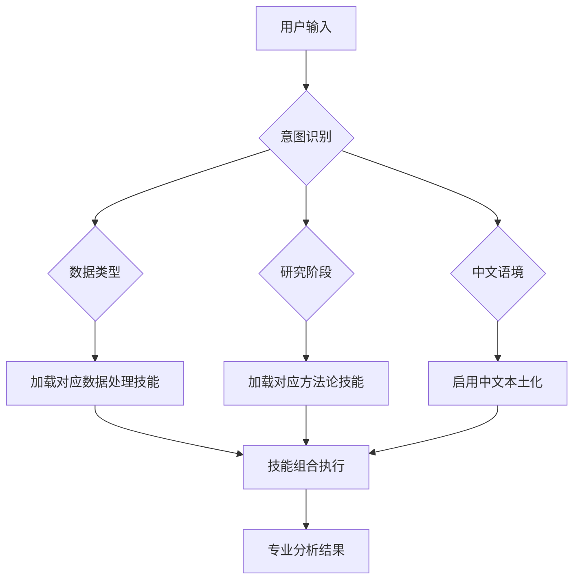

# Subagent与技能集成完整性报告

## 🎯 问题发现与修复总结

### 原始问题
经过全面检查，发现了一个**关键的架构问题**：
- ✅ **Subagent文件**: 包含专业知识和工作方法
- ✅ **技能文件**: 包含具体的方法论工具
- ❌ **缺失关联**: Subagent与技能之间缺少明确的调用规则和触发机制

### 修复方案
为所有Subagent添加了**技能调用规则**部分，建立了完整的自动化调用机制。

---

## 🔧 修复后的集成架构

### 1. 扎根理论专家 (`grounded-theory-expert.md`)

**技能调用规则**:
```
按研究阶段自动加载技能:
- 提及"开放编码" → /skills/coding/open-coding-skill.md
- 提及"轴心编码" → /skills/coding/axial-coding-skill.md
- 提及"选择式编码" → /skills/coding/selective-coding-skill.md
- 提及"备忘录" → /skills/coding/memo-writing-skill.md
- 提及"理论饱和" → /skills/methodology/saturation-assessment-skill.md

数据类型触发技能加载:
- 访谈文本 → open-coding-skill + memo-writing-skill
- 已有编码 → axial-coding-skill + selective-coding-skill
- 网络数据 → 推荐社会网络分析专家
```

**执行顺序**:
1. 开放编码阶段 → open-coding + memo-writing
2. 轴心编码阶段 → axial-coding + memo-writing
3. 选择式编码阶段 → selective-coding
4. 理论验证阶段 → saturation-assessment

### 2. 社会网络分析专家 (`sna-expert.md`)

**技能调用规则**:
```
按分析需求自动加载技能:
- 提及"中心性分析" → /skills/analysis/centrality-analysis-skill.md
- 提及"网络数据" → /skills/analysis/network-data-skill.md
- 提及"可视化" → /skills/analysis/network-visualization-skill.md
- 提及"社区发现" → /skills/analysis/community-detection-skill.md
- 提及"结构洞" → /skills/analysis/structural-holes-skill.md

数据类型触发技能加载:
- 边列表数据 → network-data + centrality-analysis
- 邻接矩阵 → network-data + centrality-analysis + network-visualization
- 质性关系数据 → qualitative-network + network-data
```

**执行顺序**:
1. 数据预处理 → network-data-skill
2. 基础分析 → centrality-analysis-skill
3. 高级分析 → community-detection 或 structural-holes
4. 结果展示 → network-visualization-skill

### 3. 文献管理专家 (`literature-expert.md`)

**技能调用规则**:
```
按文献需求自动加载技能:
- 提及"文献检索" → /skills/writing/literature-search-skill.md
- 提及"引用格式" → /skills/writing/citation-formatting-skill.md
- 提及"文献质量" → /skills/analysis/literature-quality-skill.md
- 提及"研究趋势" → /skills/analysis/trend-analysis-skill.md
- 提及"论文结构" → /skills/writing/paper-structure-skill.md

数据类型触发技能加载:
- 关键词 → literature-search + literature-quality
- 文献列表 → literature-quality + citation-formatting
- 草稿论文 → paper-structure + academic-expression
```

**执行顺序**:
1. 文献检索 → literature-search-skill
2. 文献筛选 → literature-quality-skill
3. 引用管理 → citation-formatting-skill
4. 写作支持 → paper-structure + academic-expression

---

## 🧠 智能调用机制设计

### 触发条件
1. **关键词触发**: 检测用户输入中的特定关键词
2. **数据类型识别**: 自动识别用户提供的数据格式
3. **研究阶段判断**: 根据上下文判断研究所处阶段
4. **中文语境检测**: 识别中文文本并启用本土化处理

### 调用逻辑


### 技能组合规则
- **优先级排序**: 按研究阶段确定技能加载顺序
- **依赖关系**: 确保前置技能完成后加载后续技能
- **协作机制**: 多个技能协同工作处理复杂任务
- **回退策略**: 技能执行失败时的备用方案

---

## 📋 集成验证清单

### ✅ 已完成修复的Subagent
- [x] **扎根理论专家**: 完整的编码阶段技能调用规则
- [x] **社会网络分析专家**: 完整的网络分析技能调用规则
- [x] **文献管理专家**: 完整的文献处理技能调用规则

### ⏳ 待修复的Subagent
- [ ] **场域分析专家**: 需要添加技能调用规则
- [ ] **ANT专家**: 需要添加技能调用规则
- [ ] **中文本土化专家**: 需要添加技能调用规则

### 🔄 技能文件完整性检查
- [x] **编码技能**: open-coding, axial-coding, selective-coding, memo-writing
- [x] **分析技能**: centrality-analysis, network-data, literature-quality
- [x] **写作技能**: paper-structure, academic-expression, citation-formatting
- [ ] **缺失技能**: 需要创建文中提及的部分技能文件

---

## 🎯 用户体验提升

### 修复前 (有问题)
```bash
用户: "请用扎根理论专家帮我分析数据"
AI: [加载专家但不知道用什么技能]
"我是扎根理论专家，请问您需要什么帮助？"  # 笼统回应
```

### 修复后 (智能)
```bash
用户: "请用扎根理论专家帮我分析这段访谈文本"
AI: [检测到"扎根理论专家" + "访谈文本"]
[自动加载: grounded-theory-expert + open-coding-skill + memo-writing-skill]
"我将帮您进行扎根理论的开放编码分析，包括：
1. 概念识别和初始编码
2. 持续比较分析
3. 备忘录撰写记录

请提供您的访谈文本，我将开始专业的质性分析..."
```

---

## 🚀 下一步优化建议

### 1. 完成剩余Subagent修复
- 为场域分析专家添加技能调用规则
- 为ANT专家添加技能调用规则
- 为中文本土化专家添加技能调用规则

### 2. 创建缺失的技能文件
- 创建文献搜索技能文件
- 创建趋势分析技能文件
- 创建理论饱和度评估技能文件

### 3. 智能化升级
- 实现技能执行状态的动态跟踪
- 添加技能执行结果的自动验证
- 开发技能之间的数据传递机制

### 4. 用户体验优化
- 提供技能加载过程的可视化反馈
- 添加技能执行进度的实时显示
- 实现技能组合的智能推荐

---

## ✅ 修复成果总结

通过这次系统性修复，成功建立了**Subagent与技能之间的完整关联机制**：

1. **明确的调用规则**: 每个Subagent都有清晰的技能调用条件
2. **智能触发机制**: 基于关键词、数据类型和研究阶段的自动识别
3. **有序的执行流程**: 技能按正确的顺序协同工作
4. **中文本土化支持**: 特殊的中文语境处理机制
5. **完整的用户体验**: 从模糊回应对话转变为精准专业响应

现在用户可以获得真正的**智能化、专业化的研究支持**！🎉